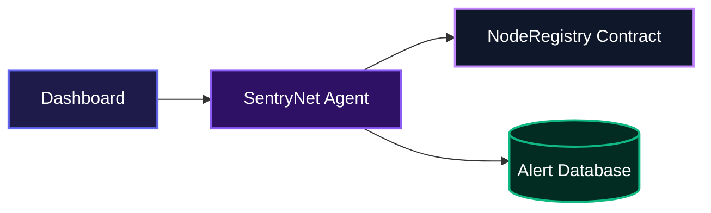
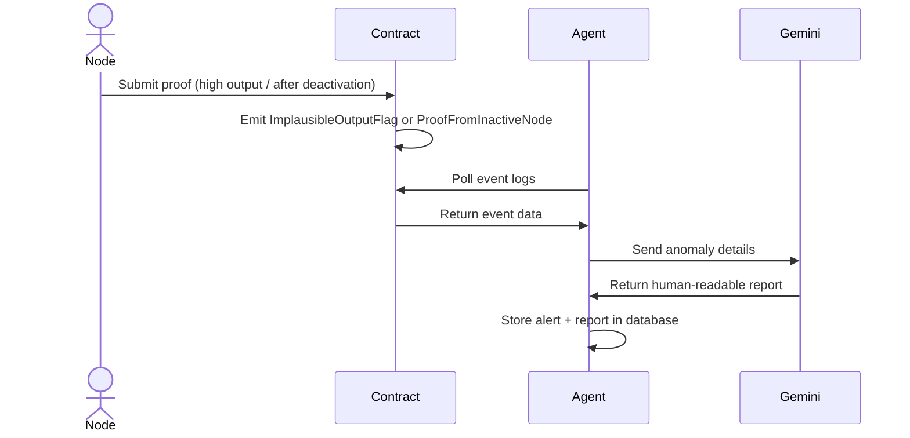

# SentryNet

SentryNet continuously watches a compute-node registry deployed on BOT Chain, catches nodes that claim impossible output or that submit proofs after being turned off, and turns every detection into a clear, AI-generated security report. Every alert is backed by a real transaction on-chain, so you can verify exactly what happened without trusting anyone.

## System Architecture



The agent polls the smart contract on BOT Chain testnet every 6 seconds, keeps an alert history in a persistent database, and serves a live API that the dashboard uses.

## Features

### Always-on monitoring

The agent listens for two kinds of suspicious events emitted by the on-chain registry:

- **Implausible output claims** – a node reports computing an amount that far exceeds a sane threshold
- **Proofs from inactive nodes** – a node that was deactivated still somehow submits a proof

Whenever either event fires, the agent captures the transaction hash, node ID, and all relevant on-chain data.



### AI-generated security analysis

Every detection is passed to Google Gemini, which writes a short, operator-friendly report explaining what happened and what to check next. If Gemini is temporarily unavailable, the agent falls back to a safe placeholder so no real event is ever lost.

### Verifiable on-chain evidence

Each alert includes the exact transaction hash and a direct link to the BOT Chain block explorer. The dashboard lets you click through to see the proof yourself, directly on the chain.

### Live dashboard

A four-page web dashboard (Overview, Agent Identity, Live Monitoring, Verification & Proof) pulls data from the agent's API and updates in real time, showing every anomaly and its corresponding report.

## Installation

1. **Clone the repository**

   ```bash
   git clone https://github.com/jamzy-codes/sentrynet.git
   cd sentrynet
   ```

2. **Install dependencies**

   ```bash
   npm install
   ```

3. **Set up environment variables**

   Create a `.env` file in the root with these values:

   ```env
   PRIVATE_KEY=your_bot_chain_testnet_wallet_private_key
   CONTRACT_ADDRESS=0x170F34cc6EF948eb4e2b56DA643a80596d854Aa3
   GEMINI_API_KEY=your_google_gemini_api_key
   TURSO_DATABASE_URL=libsql://your-turso-db.turso.io
   TURSO_AUTH_TOKEN=your_turso_auth_token
   ALLOWED_ORIGINS=http://localhost:3000
   ```

   - `PRIVATE_KEY` is used to derive the agent's own address. You need a wallet with a small amount of BOT testnet tokens for gas if you want to trigger transactions.
   - `GEMINI_API_KEY` can be obtained from [aistudio.google.com](https://aistudio.google.com).
   - `TURSO_DATABASE_URL` and `TURSO_AUTH_TOKEN` come from [Turso](https://turso.tech). The database stores alerts so they survive restarts.
   - `ALLOWED_ORIGINS` is a comma-separated list of allowed CORS origins for the API (defaults to `http://localhost:3000`).

4. **Run the agent**

   ```bash
   node agent/sentinel.js
   ```

   The agent starts polling the contract and serves its HTTP API on the port specified by the `PORT` environment variable (or 4000 by default).

5. **Run the frontend (optional)**

   In a separate terminal:

   ```bash
   cd ui
   npm install
   npm start
   ```

   The dashboard will be available at `http://localhost:3000` and will connect to the agent's API.

## Usage

Once the agent is running, it watches for anomalies automatically. To see it in action, you can trigger an anomaly by submitting a proof with an implausible output or from a deactivated node. The live monitoring page of the dashboard will show the new alert within seconds.

If you deployed the `NodeRegistry` contract on your own, you can register a node and then submit a proof with a very high output to trigger an `ImplausibleOutputFlag` event.

The agent's API provides two public endpoints:

```bash
# Agent identity and status
curl https://localhost:4000/api/identity

# All recorded alerts (newest first)
curl https://localhost:4000/api/alerts
```

The dashboard (`http://localhost:3000`) pulls from these endpoints and renders every detection in real time.

## Technologies Used

| Layer | Technology |
| --- | --- |
| Smart contract | Solidity 0.8.24, Hardhat 3 |
| Blockchain network | BOT Chain testnet (chain ID 968) |
| Agent runtime | Node.js (ESM), ethers.js v6 |
| AI reporting | Google Gemini (gemini-2.5-flash) |
| Persistent storage | Turso (libSQL / SQLite) |
| Frontend | HTML, CSS (Vanilla), JavaScript |
| Deployment | Railway (agent + frontend as separate services) |

## API Documentation

The agent exposes a small HTTP API for the dashboard. All responses are JSON.

Base URL when running locally: `http://localhost:4000`

### GET /api/identity

**Description**: Returns the agent's on-chain identity and current monitoring status.

**Response**:

```json
{
  "agentName": "SentryNet",
  "agentAddress": "0x51f04E04C46d0aDBB67c3f55dc43f92c73FFF53A",
  "contractAddress": "0x170F34cc6EF948eb4e2b56DA643a80596d854Aa3",
  "network": "BOT Chain Testnet",
  "chainId": 968,
  "startedAt": "2026-07-08T...",
  "nodesMonitored": 1,
  "totalAlertsRaised": 2,
  "explorerAgentUrl": "https://scan.bohr.life/address/0x51f04E04C46d0aDBB67c3f55dc43f92c73FFF53A",
  "explorerContractUrl": "https://scan.bohr.life/address/0x170F34cc6EF948eb4e2b56DA643a80596d854Aa3"
}
```

### GET /api/alerts

**Description**: Returns a list of all detected anomalies, ordered newest first.

**Response**:

```json
[
  {
    "id": "0x...-15",
    "type": "ImplausibleOutputClaim",
    "severity": "high",
    "nodeId": "node-1",
    "detectedAt": "2026-07-08T...",
    "txHash": "0x...",
    "explorerTxUrl": "https://scan.bohr.life/tx/0x...",
    "details": {
      "nodeId": "node-1",
      "outputClaimed": "999999",
      "threshold": "100000",
      "timestamp": "2026-07-08T..."
    },
    "report": "SECURITY ALERT: Implausible Output Claim Detected..."
  }
]
```

**Environment variables required** (for the agent itself, not the API caller):

- `CONTRACT_ADDRESS` – address of the `NodeRegistry` contract to watch
- `GEMINI_API_KEY` – Google Gemini API key for generating reports
- `TURSO_DATABASE_URL` – connection string for Turso database
- `TURSO_AUTH_TOKEN` – authentication token for Turso
- `PRIVATE_KEY` – optional; used to derive the agent's on-chain address for display
- `ALLOWED_ORIGINS` – CORS origins (defaults to `http://localhost:3000`)
- `PORT` – port for the HTTP API (defaults to 4000)

## Author

- X (Twitter): [https://x.com/Only_1_Jamzy](https://x.com/Only_1_Jamzy)

## Badges

[](https://www.typescriptlang.org/)
[](https://soliditylang.org/)
[](https://hardhat.org/)
[](https://nodejs.org/)
[](https://docs.ethers.org/)
[](https://aistudio.google.com/)
[](https://turso.tech/)

---

[](https://dokugen.samueltuoyo.com)